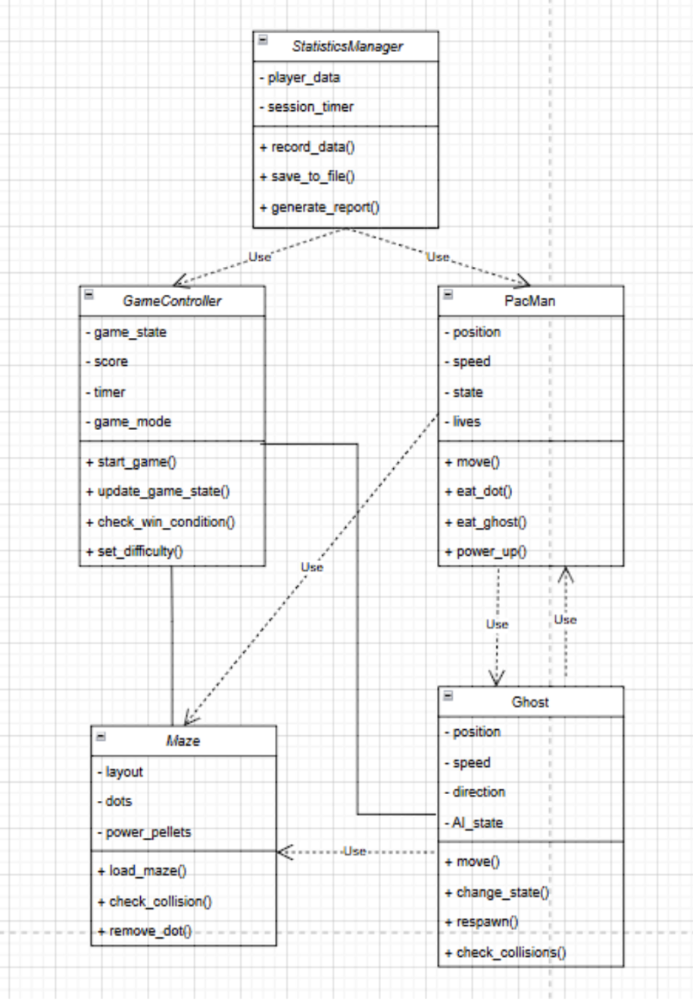
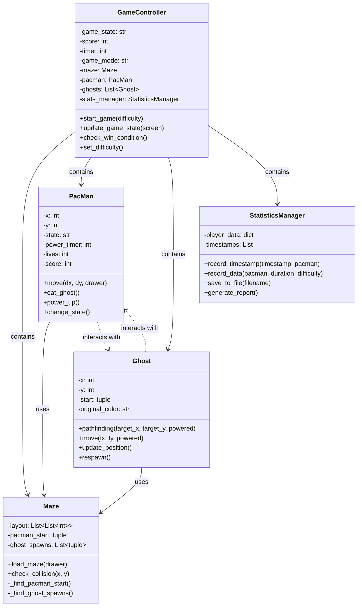

# Pixel Chomp

## 1. Project Overview
This project tries to create a Pac-Man game with Python and the Pygame. The game contains a classic arcade-style maze in which the player controls Pac-Man to eat dots and avoid ghosts. Pac-Man's game mechanics include power-ups that allow him to eat ghosts for a brief time, different difficulty levels, and score tracking.

## 2. Project Review
An analysis of existing Pac-Man implementations, including the current Python-based Pygame version, highlights several areas for improvement:
- Improved pathfinding and movement patterns for ghosts.
- Add player statistics collection for performance insights.
- Add timer for track time usage each round
- Three difficulty levels with different gameplay mechanics

## 3. Programming Development

### 3.1 Game Concept
The objective of the game is to guide Pac-Man through a maze, collecting all the dots while avoiding ghosts. Power pellets scattered throughout the maze temporarily allow Pac-Man to eat ghosts for bonus points. The player wins by clearing all the dots in the maze. And the player loses if Pac-Man loses all his lives after being caught by ghosts.

**Game Modes:**
1. **Easy**: Standard gameplay
2. **Normal**: Faster ghosts, shorter power-up duration
3. **Hard**: More ghosts, high speed, fewer power-ups

## 3.2 Object-Oriented Programming Implementation

### PacMan (The player-controlled character)
**Attributes:**
- `x, y`: Current location on the grid
- `state`: Normal or powered-up state ('normal' or 'powered')
- `power_timer`: Duration of power-up effect
- `lives`: Remaining lives
- `score`: Current score
- `dots_collected`: Number of dots eaten
- `ghosts_eaten`: Number of ghosts eaten
- `power_pallets_collected`: Number of power pellets collected
- `icon`: Turtle object for drawing

**Methods:**
- `move()`: Updates player position and handles dot collection
- `eat_ghost()`:Add score if powered-up
- `power_up()`:  Enables temporary ability to eat ghosts
- `change_state()`: Updates power pellet timer and state
- `update_position()`: Updates Pac-Man's position on screen
- `_setup_icon()`: Sets up Pac-Man's turtle icon
- `_calculate_screen_position()`: Converts grid position to screen coordinates

### Ghost (Enemy chasing the player)
**Attributes:**
- `x, y`: Current location on the grid
- `start`: Spawn position
- `original_color`: Ghost's color
- `shape_name`: Custom ghost shape name
- `icon`: Turtle object for drawing
- `GHOST_COLORS`: Dictionary mapping color names to hex values

**Methods:**
- `pathfinding()`: A* pathfinding algorithm to find path to target or away from Pac-Man when powered
- `move()`: Moves ghost towards target position or away from Pac-Man when powered
- `update_position()`: Updates ghost's position and appearance
- `respawn()`: Resets position after being eaten
- `register_ghost_shape()`: Registers custom ghost shape for given color

### Maze (The game map and items on it)
**Attributes:**
- `layout`: Maze structure (0=wall, 1=dot, 2=power pellet, 3=empty, 4=Pac-Man start, 5=ghost spawn)
- `pacman_start`: Starting position for Pac-Man
- `ghost_spawns`: List of ghost spawn positions
- `TILE_SIZE`: Size of each maze tile (24 pixels)
- `MAZE_OFFSET_X, MAZE_OFFSET_Y`: Screen offset for maze drawing (-252, 252)

**Methods:**
- `load_maze()`: Loads and draws maze on screen
- `check_collision()`: Checks if position is a wall
- `_find_pacman_start()`: Finds Pac-Man's starting position
- `_find_ghost_spawns()`: Finds ghost spawn positions

### GameController (Manages game state and controls)
**Attributes:**
- `game_state`: Current game state (menu/running/game_over)
- `score`: Current player score
- `timer`:  Tracks time for session and power-ups
- `game_mode`: Current difficulty level
- `stats_manager`: Statistics tracking
- `maze`: Current maze instance
- `pacman`: Pac-Man instance
- `ghosts`: List of ghost instances
- `drawer`: Turtle object for drawing
- `btn_style`: Dictionary of button styling properties

**Methods:**
- `start_game()`: Initializes and starts new game
- `update_game_state()`: Updates game logic on each frame
- `check_win_condition()`: Checks if all dots are collected
- `set_difficulty()`: Shows difficulty selection menu
- `update_status()`: Updates status display
- `game_over_screen()`: Shows game over screen
- `setup_controls()`: Sets up keyboard controls
- `restart()`: Restarts current game
- `quit_to_main()`: Returns to main menu
- `show_main_menu()`: Displays main menu
- `show_how_to_play()`: Shows game instructions

### StatisticsManager (Collects and analyzes player data)
**Attributes:**
- `player_data`: Stores all gameplay statistics
- `timestamps`: List of game timestamps
- `fig`: Matplotlib figure for graphs
- `canvas`: Canvas for displaying graphs

**Methods:**
- `record_timestamp()`: Records game timestamp
- `record_data()`: Tracks gameplay
- `save_to_file()`: Outputs data to CSV
- `generate_report()`: Generates performance report
- `plot_text_stats()`: Plots text statistics
- `plot_dots_by_difficulty()`: Plots dots collected by difficulty
- `plot_ghosts_eaten()`: Plots ghosts eaten over sessions
- `plot_high_scores()`: Plots high scores per session
- `plot_player_vs_ghost()`: Plots player vs ghost ratio
- `show_graph_selector()`: Shows graph selection window

## 3.3 Algorithms Involved
- **Pathfinding**: A* or BFS algorithm for ghost movement.  
- **Event-driven mechanics**: Handling keypresses and game events dynamically.  
- **Timer Tracking**: Tracks total playtime and session duration.  

## 4. Statistical Data (Prop Stats)

### 4.1 Data Features
The game will track the following player metrics:
- Number of power pellets collected  
- Number of dots collected  
- Number of ghosts eaten  
- Survival time per game session  
- High score history  

### 4.2 Data Recording Method
Statistical data will be stored in a CSV file.

### 4.3 Data Analysis Report

**Basic Statistics – Measures player performance using:**
- **Mean** – Average dots collected per game in different game modes.  
- **Median** – Median of survival time.  
- **Standard Deviation** – Shows consistency in performance.  

**Performance Trends – Tracks player improvement over multiple sessions by analyzing:**
- Score progression over time  
- Survival time trends  
- Ghost encounters  

**Visualization**
- **Line Graphs** → Score progression over sessions  
- **Bar Charts** → Comparing performance in different game modes  
- **Pie Charts** → Player vs. ghost ratio  

## 5. Project Timeline

| Week | Task |
|------|------|
| 1 (10 Mar) | Proposal submission / Project initiation |
| 2 (17 Mar) | Full proposal submission |
| 3 (24 Mar) | Initial game prototype development |
| 4 (31 Mar) | Implementation of AI  |
| 5 (7 Apr) | Implementing difficulty modes and statistical analysis integration|
| 6 (14 Apr) | Submission week (Draft) |

### Milestone Breakdown

| Week              | Goal                                                               | Milestone                                                                 |
|-------------------|--------------------------------------------------------------------|---------------------------------------------------------------------------|
| 1 (10 March)       | Proposal submission / Project initiation                           | Proposal is submitted, project initiation complete                        |
| 2 (17 March)       | Full proposal submission                                           | Full proposal is submitted and approved                                   |
| 3 (3 April - 9 April) | Initial game prototype development                                | Basic game prototype with core mechanics is developed                     |
| 4 (10 April - 16 April) | Implementation of AI                                              | Ghost AI implemented and functional (pathfinding, chase)                 |
| 5 (17 April - 23 April) | Implementing difficulty modes and statistical analysis integration. Start final game testing. | Multiple difficulty modes implemented, statistical tracking integrated    |
| 6 (24 April - 11 May) | Final polishing, bug fixing, and documentation. Ensure final presentation and report submission. | Draft submission completed, final game polishing and testing done         |

---

# Game Feature Data Collection Plan

| **Feature**                | **Why is it good to have this data?**                                                                                       | **How will you obtain 50 values of this feature data?**                                | **Variable (Class)**                             | **Display Method**                                                |
|----------------------------|------------------------------------------------------------------------------------------------------------------------------|-----------------------------------------------------------------------------------------|--------------------------------------------------|-------------------------------------------------------------------|
| **Number of dots collected**   | Measures player efficiency in clearing the maze and tracks performance.                                                     | Record the number of dots Pac-Man has eaten at 10 different timestamps per game.        | `StatisticsManager.dots_collected` (PacMan Class)           | Box Plot (Comparing power pellet collection across difficulty modes) |
| **Number of ghosts eaten**    | Indicates player's risk-taking behavior and effectiveness in using power-ups.                                               | Track every ghost eaten at 10 different timestamps per game.                            | `StatisticsManager.ghosts_eaten` (PacMan Class)             | Line Graph (Tracking ghost-eating trend over sessions)           |
| **Survival time per game session** | Shows how long players last, helping analyze difficulty balance. Useful for tracking improvements in player skill.         | Record survival time every 5 seconds.                                                  | `StatisticsManager.timestamps` (StatisticsManager Class) | Mean Deviation                                     |
| **High score per game**        | Helps track player progression and performance trends over time. Used to compare skill levels in different difficulty modes. | Log the current score at 10 different timestamps per game.                              | `GameController.score` (GameController Class)     | Line Graph (Score progression over multiple sessions)           |
| **Player vs. Ghost Ratio**     | Analyzes player aggression vs. caution, power-up effectiveness, and difficulty balancing.                                  | Track every ghost eaten and Pac-Man eaten by ghost at 10 different timestamps per game. | `StatisticsManager.ghosts_eaten` and `StatisticsManager.lives_lost` (PacMan Class) | Pie Chart (Comparing eaten ghosts vs. times eaten by ghosts)    |

---

# Graph Overview for Game Analytics

| **Graph** | **Feature Name**               | **Graph Objective**                                          | **Graph Type**  | **X-axis**                                   | **Y-axis**                        |
|-----------|--------------------------------|--------------------------------------------------------------|------------------|-----------------------------------------------|----------------------------------|
|   1   | Number of dots collected       | Measure player efficiency in clearing the maze              | Box Plot        | Difficulty Mode                                | Dots Collected                   |
|   2   | Number of ghosts eaten         | Track risk-taking behavior and power-up effectiveness       | Line Graph       | Session Number                                 | Number of Ghosts Eaten          |
|   3   | Survival time per game session | Assess player endurance and difficulty balance              | Median, SD       | Session Number                                 | Survival Time (Seconds)         |
|   4   | High score per game            | Track progression and compare skill levels                  | Line Graph       | Session Number                                 | Score                            |
|   5   | Player vs. Ghost Ratio         | Show ratio of players eating ghosts vs. being eaten         | Pie Chart        | Pac-Man Eating Ghosts vs. Pac-Man Eaten by Ghosts | Percentage of Total Interactions |

---

# UML

## 3.3 Class Relationships and UML

### Class Relationships

1. **GameController** (Main Controller)
   - Has-a **Maze**: Manages the game map
   - Has-a **PacMan**: Controls the player character
   - Has-many **Ghost**: Manages multiple ghost instances
   - Has-a **StatisticsManager**: Handles game statistics
   - Uses **turtle.Screen**: For game display
   - Uses **tkinter**: For UI elements

2. **PacMan** (Player)
   - Has-a **Maze**: References for movement and collision
   - Uses **turtle.Turtle**: For visual representation
   - Interacts with **Ghost**: For ghost eating mechanics

3. **Ghost** (Enemy)
   - Has-a **Maze**: References for movement and collision
   - Uses **turtle.Turtle**: For visual representation
   - Interacts with **PacMan**: For chase/escape mechanics

4. **Maze** (Game Map)
   - Contains game layout data
   - Provides collision detection
   - Manages spawn points

5. **StatisticsManager** (Data Handler)
   - Uses **pandas**: For data analysis
   - Uses **matplotlib**: For visualization
   - Uses **tkinter**: For statistics UI

### UML Diagram

### Key Relationships Explained

1. **Composition Relationships**
   - GameController owns and manages all other game objects
   - Each object (PacMan, Ghost) has its own turtle instance for rendering

2. **Dependency Relationships**
   - PacMan and Ghost depend on Maze for movement and collision
   - All classes use turtle for graphics
   - StatisticsManager depends on pandas and matplotlib for data handling

3. **Interaction Patterns**
   - PacMan and Ghost interact for chase/escape mechanics
   - GameController coordinates all interactions
   - StatisticsManager observes and records game events

4. **Data Flow**
   - Game state flows from GameController to other objects
   - Statistics flow from game objects to StatisticsManager
   - User input flows through GameController to PacMan

This UML diagram and relationship description provides a clear overview of how the different components of the game interact with each other and their responsibilities.
