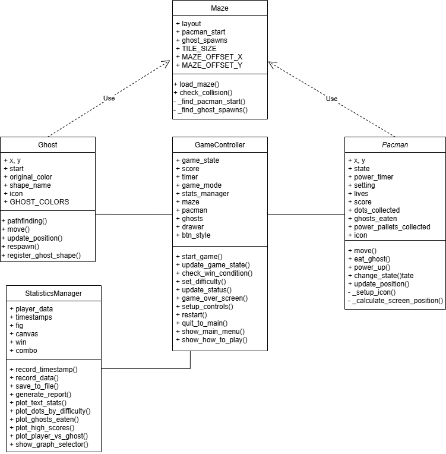

# Pixel Chomp

## 1. Project Overview
This project tries to create a Pac-Man game with Python and the Pygame. The game contains a classic arcade-style maze in which the player controls Pac-Man to eat dots and avoid ghosts. Pac-Man's game mechanics include power-ups that allow him to eat ghosts for a brief time, different difficulty levels, and score tracking.

## 2. Project Review
An analysis of existing Pac-Man implementations, including the current Python-based Pygame version, highlights several areas for improvement:
- Improved pathfinding and movement patterns for ghosts.
- Add player statistics collection for performance insights.
- Add timer for track time usage each round
- Three difficulty levels with different gameplay mechanics

## 3. Programming Development

### 3.1 Game Concept
The objective of the game is to guide Pac-Man through a maze, collecting all the dots while avoiding ghosts. Power pellets scattered throughout the maze temporarily allow Pac-Man to eat ghosts for bonus points. The player wins by clearing all the dots in the maze. And the player loses if Pac-Man loses all his lives after being caught by ghosts.

**Game Modes:**
1. **Easy**: Standard gameplay
2. **Normal**: Faster ghosts, shorter power-up duration
3. **Hard**: More ghosts, high speed, fewer power-ups

## 3.2 Object-Oriented Programming Implementation

### PacMan (The player-controlled character)
**Attributes:**
- `position`: Current location on the grid  
- `speed`: Movement speed  
- `state`: Normal or powered-up  
- `lives`: Remaining lives  

**Methods:**
- `move()`: Updates player position  
- `eat_dot()`: Add score, removes dot  
- `eat_ghost()`: Add score if powered-up  
- `power_up()`: Enables temporary ability to eat ghosts  

### Ghost (Enemy chasing the player)
**Attributes:**
- `position`: Current location on the grid  
- `speed`: Movement speed  
- `direction`: Current moving direction  
- `AI_state`: chase/scatter/frightened  

**Methods:**
- `move()`: Pathfinding logic  
- `change_state()`: Switches AI mode  
- `respawn()`: Resets position after being eaten  
- `check_collisions()`: Interacts with Pac-Man and walls  

### Maze (The game map and items on it)
**Attributes:**
- `layout`: Maze structure  
- `dots`: Positions of collectible dots  
- `power_pellets`: Positions of power-ups  

**Methods:**
- `load_maze()`: Loads maze from file  
- `check_collision()`: Detects wall interactions  
- `remove_dot()`: Removes collected items  

### GameController (Manages game logic and rules)
**Attributes:**
- `game_state`: Running, paused, game over  
- `score`: Current player score  
- `timer`: Tracks time for session and power-ups  
- `game_mode`: Current difficulty level  

**Methods:**
- `start_game()`: Initializes and starts a new game  
- `update_game_state()`: Updates game logic on each frame  
- `check_win_condition()`: Detects win/loss  
- `set_difficulty()`: Adjusts settings in each mode  

### StatisticsManager (Collects and analyzes player data)
**Attributes:**
- `player_data`: Stores all gameplay statistics  
- `session_timer`: Measures the duration of each play session  

**Methods:**
- `record_data()`: Tracks gameplay  
- `save_to_file()`: Outputs to CSV  
- `generate_report()`: Calculates stats  

## 3.3 Algorithms Involved
- **Pathfinding**: A* or BFS algorithm for ghost movement.  
- **Event-driven mechanics**: Handling keypresses and game events dynamically.  
- **Timer Tracking**: Tracks total playtime and session duration.  

## 4. Statistical Data (Prop Stats)

### 4.1 Data Features
The game will track the following player metrics:
- Number of power pellets collected  
- Number of dots collected  
- Number of ghosts eaten  
- Survival time per game session  
- High score history  

### 4.2 Data Recording Method
Statistical data will be stored in a CSV file.

### 4.3 Data Analysis Report

**Basic Statistics – Measures player performance using:**
- **Mean** – Average dots collected per game in different game modes.  
- **Median** – Median of survival time.  
- **Standard Deviation** – Shows consistency in performance.  

**Performance Trends – Tracks player improvement over multiple sessions by analyzing:**
- Score progression over time  
- Survival time trends  
- Ghost encounters  

**Visualization**
- **Line Graphs** → Score progression over sessions  
- **Bar Charts** → Comparing performance in different game modes  
- **Pie Charts** → Player vs. ghost ratio  

## 5. Project Timeline

| Week | Task |
|------|------|
| 1 (10 Mar) | Proposal submission / Project initiation |
| 2 (17 Mar) | Full proposal submission |
| 3 (24 Mar) | Initial game prototype development |
| 4 (31 Mar) | Implementation of AI  |
| 5 (7 Apr) | Implementing difficulty modes and statistical analysis integration|
| 6 (14 Apr) | Submission week (Draft) |

### Milestone Breakdown

| Week              | Goal                                                               | Milestone                                                                 |
|-------------------|--------------------------------------------------------------------|---------------------------------------------------------------------------|
| 1 (10 March)       | Proposal submission / Project initiation                           | Proposal is submitted, project initiation complete                        |
| 2 (17 March)       | Full proposal submission                                           | Full proposal is submitted and approved                                   |
| 3 (3 April - 9 April) | Initial game prototype development                                | Basic game prototype with core mechanics is developed                     |
| 4 (10 April - 16 April) | Implementation of AI                                              | Ghost AI implemented and functional (pathfinding, chase)                 |
| 5 (17 April - 23 April) | Implementing difficulty modes and statistical analysis integration. Start final game testing. | Multiple difficulty modes implemented, statistical tracking integrated    |
| 6 (24 April - 11 May) | Final polishing, bug fixing, and documentation. Ensure final presentation and report submission. | Draft submission completed, final game polishing and testing done         |

---

# Game Feature Data Collection Plan

| **Feature**                | **Why is it good to have this data?**                                                                                       | **How will you obtain 50 values of this feature data?**                                | **Variable (Class)**                             | **Display Method**                                                |
|----------------------------|------------------------------------------------------------------------------------------------------------------------------|-----------------------------------------------------------------------------------------|--------------------------------------------------|-------------------------------------------------------------------|
| **Number of dots collected**   | Measures player efficiency in clearing the maze and tracks performance.                                                     | Record the number of dots Pac-Man has eaten at 10 different timestamps per game.        | `PacMan.dots_collected` (PacMan Class)           | Bar Chart (Comparing power pellet collection across difficulty modes) |
| **Number of ghosts eaten**    | Indicates player’s risk-taking behavior and effectiveness in using power-ups.                                               | Track every ghost eaten at 10 different timestamps per game.                            | `PacMan.ghosts_eaten` (PacMan Class)             | Line Graph (Tracking ghost-eating trend over sessions)           |
| **Survival time per game session** | Shows how long players last, helping analyze difficulty balance. Useful for tracking improvements in player skill.         | Record survival time every 10 seconds.                                                  | `StatisticsManager.session_timer` (StatisticsManager Class) | Median, Standard Deviation                                     |
| **High score per game**        | Helps track player progression and performance trends over time. Used to compare skill levels in different difficulty modes. | Log the current score at 10 different timestamps per game.                              | `GameController.score` (GameController Class)     | Line Graph (Score progression over multiple sessions)           |
| **Player vs. Ghost Ratio**     | Analyzes player aggression vs. caution, power-up effectiveness, and difficulty balancing.                                  | Track every ghost eaten and Pac-Man eaten by ghost at 10 different timestamps per game. | `PacMan.eat_ghost()` and `PacMan.live` (PacMan Class) | Pie Chart (Comparing eaten ghosts vs. times eaten by ghosts)    |

---

# Graph Overview for Game Analytics

| **Graph** | **Feature Name**               | **Graph Objective**                                          | **Graph Type**  | **X-axis**                                   | **Y-axis**                        |
|-----------|--------------------------------|--------------------------------------------------------------|------------------|-----------------------------------------------|----------------------------------|
|   1   | Number of dots collected       | Measure player efficiency in clearing the maze              | Bar Chart        | Difficulty Mode                                | Dots Collected                   |
|   2   | Number of ghosts eaten         | Track risk-taking behavior and power-up effectiveness       | Line Graph       | Session Number                                 | Number of Ghosts Eaten          |
|   3   | Survival time per game session | Assess player endurance and difficulty balance              | Median, SD       | Session Number                                 | Survival Time (Seconds)         |
|   4   | High score per game            | Track progression and compare skill levels                  | Line Graph       | Session Number                                 | Score                            |
|   5   | Player vs. Ghost Ratio         | Show ratio of players eating ghosts vs. being eaten         | Pie Chart        | Pac-Man Eating Ghosts vs. Pac-Man Eaten by Ghosts | Percentage of Total Interactions |

---

# UML

